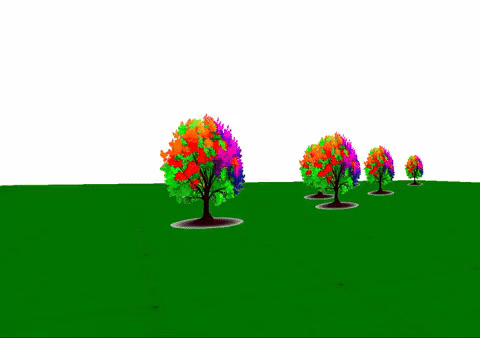

[](https://pkg.go.dev/github.com/donomii/sceneCamera)

SceneCamera
===========

Easy 3D camera management

Description
===========

SceneCamera manages the camera for 3D applications.  It provides the V, in the GL trinity MVP.  And if needed, the P as well.



It comes with 3 convenient modes, museum mode, first person mode, and RTS (Real Time Strategy) mode.

It is designed to work with OpenGL, but does not rely on any graphics libraries (just a matrix lib).  It could be used with other graphics libraries, but you may have to copy the matrices into your graphics library's matrix format.

### Examples

An example program is included in the examples directory.  It can be run with

    cd examples
    go run .

### Museum mode
Museum mode is a simple camera that orbits around a point, and can zoom in and out.  Draw your object at the origin, and the camera will orbit around it.  It is useful for inspecting 3D models from all angles.

### First person mode / flight mode

The classic game mode.  Move forwards, backwards, strafe and turn.  It can also pitch, roll, and yaw, making it useful for flight simulators.

### RTS mode

The camera floats over a ground plane.  Forwards, backwards and strafe slide the camera along the ground plane.  It can also spin around a point on the the map, using the pitch and yaw.

## SBS (Side by Side) rendering

SceneCamera provides the correct matrices for rendering in SBS (or twin display) mode.  Rather than taking control of the render like many graphics libraries, sceneCamera just hands you the matrices so that you can use them in your own render.  See the example directory for more details.

a quick summary:
```
func RenderStereoFrame(state *State) {
    // Set the inter-pupilary distance.  Not critical, but the wrong value will make you feel sick.
	camera.SetIPD(2.0)

	//get window width and height
	width, height := MainWin.GetSize()
	camera.Screenwidth = float32(width)/2
	camera.Screenheight = float32(height)


    //Get the view matrix for the left eye
	LeftviewMatrix := camera.LeftEyeViewMatrix()

    //Get the projection matrix for the left eye
	LeftEyeFrustrum := camera.LeftEyeFrustrum()

	// Set the viewport to left half of the window
	gl.Viewport(0, 0, int32(width/2), int32(height))

    //Render the scene to the left eye
	RenderFrame(state, LeftviewMatrix, LeftEyeFrustrum)


    //Get the matrices for the right eye
	viewMatrix := camera.RightEyeViewMatrix()
	RightProjectionMatrix := camera.RightEyeFrustrum()

    //Set the viewport to right half of the window
	gl.Viewport(int32(width/2), 0, int32(width/2), int32(height))

    Draw the scene to the right eye display
	RenderFrame(state, viewMatrix, RightProjectionMatrix)


	//Set viewport to whole window
	gl.Viewport(0, 0, int32(width), int32(height))
}
```

## Default position

The camera starts at z=5 (0,0,5), looking at the origin(0,0,0).  Positive Y is up (0,1,0).

In RTS mode, the camera starts at (10,10,10), looking at the origin(0,0,0).  Positive **Z** is up (0,0,1).  The ground plane is at z=0, covering the x and y axes.  i.e. the ground normal vector is (0,0,1).

All these settings can be changed by setting the appropriate field.

## Typical use

    "github.com/donomii/sceneCamera"

    //Create a new camera
    camera := Cameras.New(2)  //FPS mode

    camera.Move(0,0.5)  //Move forwards 0.5 world units

    viewMatrix := camera.ViewMatrix()  //Get the view matrix for the camera

	cameraUniform := gl.GetUniformLocation(state.Program, gl.Str("camera\x00"))
	gl.UniformMatrix4fv(cameraUniform, 1, false, &viewMatrix[0])

    // Draw your scene

