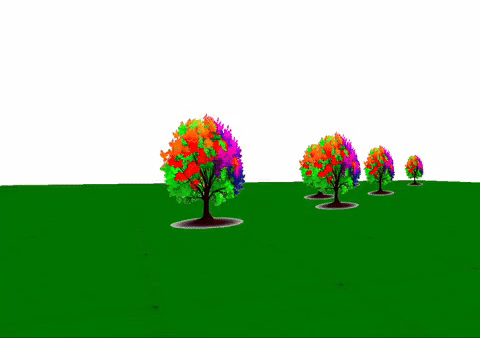
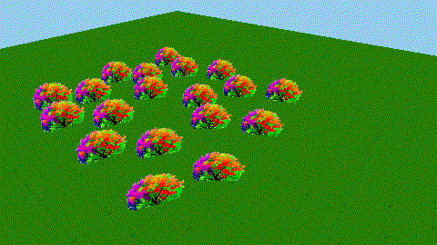
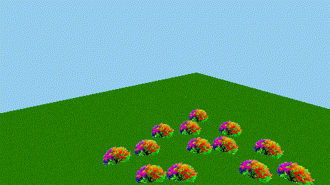

# SceneCamera

[](https://github.com/donomii/sceneCamera/actions/workflows/github-actions-demo.yml)
[](https://codecov.io/gh/donomii/sceneCamera)
[](https://pkg.go.dev/github.com/donomii/sceneCamera)
[](https://goreportcard.com/report/github.com/donomii/sceneCamera)

SceneCamera provides camera movement and view/projection matrices for Go 3D applications. It supports museum, first-person, and real-time strategy movement, plus side-by-side stereo rendering.

## Demos

### FPS mode



### RTS mode



### Flight mode



It is designed for OpenGL but only depends on [mathgl](https://github.com/go-gl/mathgl). The returned matrices can be copied into another graphics library's matrix format.

## Install

```text
go get github.com/donomii/sceneCamera@latest
```

## Quick start

```go
package main

import (
	"fmt"

	sceneCamera "github.com/donomii/sceneCamera"
)

func main() {
	camera := sceneCamera.New(2)
	camera.Move(0, 0.5)

	viewMatrix := camera.ViewMatrix()
	fmt.Println(viewMatrix)
}
```

Modes are selected when creating a camera:

- `sceneCamera.New(1)` — museum mode, which orbits a target and zooms in or out.
- `sceneCamera.New(2)` — FPS/flight mode, with translation, pitch, and yaw. Roll inputs are ignored.
- `sceneCamera.New(3)` — RTS mode, which moves over a ground plane and orbits a point on that plane.

`Move` takes a direction and an amount. Translation amounts use world units; rotation amounts use radians.

| Direction | Operation |
| --- | --- |
| `0` | Forward |
| `1` | Backward |
| `2` | Left |
| `3` | Right |
| `4` | Up |
| `5` | Down |
| `6` | Pitch up |
| `7` | Pitch down |
| `8` | Yaw left |
| `9` | Yaw right |
| `10` | Roll left |
| `11` | Roll right |

Each mode applies only the operations that make sense for that camera style.

## Side-by-side stereo rendering

SceneCamera returns separate view and projection matrices for each eye without taking control of rendering:

```go
func RenderStereoFrame(state *State) {
	// Set the inter-pupillary distance in world units.
	camera.SetIPD(2.0)

	width, height := MainWin.GetSize()
	camera.Screenwidth = float32(width) / 2
	camera.Screenheight = float32(height)

	leftViewMatrix := camera.LeftEyeViewMatrix()
	leftProjectionMatrix := camera.LeftEyeFrustum()
	gl.Viewport(0, 0, int32(width/2), int32(height))
	RenderFrame(state, leftViewMatrix, leftProjectionMatrix)

	rightViewMatrix := camera.RightEyeViewMatrix()
	rightProjectionMatrix := camera.RightEyeFrustum()
	gl.Viewport(int32(width/2), 0, int32(width/2), int32(height))
	RenderFrame(state, rightViewMatrix, rightProjectionMatrix)

	gl.Viewport(0, 0, int32(width), int32(height))
}
```

## Default position

Museum and FPS cameras start at `(0, 0, 5)`, looking at the origin, with positive Y as up.

RTS cameras start at `(5, 5, 5)`, looking at the origin, with positive Z as up. The default ground plane is `z=0`, with the normal `(0, 0, 1)`.

These settings can be changed through the camera fields and setter methods.

## Example application

The `example` directory contains an OpenGL application:

```text
cd example
go run .
```

### Regenerating the demo GIFs

Run either no-argument launcher from the `example` directory:

```text
./record-rts-demo.sh
./record-flight-demo.sh
```

Each launcher renders a deterministic 480×270 animation with 72 frames over 5.04 seconds and replaces its corresponding GIF in the repository root.
